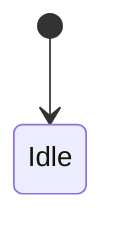
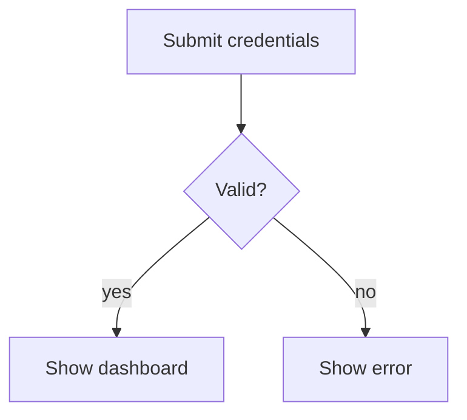

# Mermaid Diagram

## Input
One of:
- A free-form diagram specification: a natural-language description of what the
  diagram should show (steps, flows, states, entities, data, time, hierarchy,
  etc.). It may also name a specific diagram type.
- An existing `mermaid` code block (typically inside a note) plus a requested
  change to that diagram.

## Output
- Creation: a single fenced `mermaid` code block for the chosen type.
- Editing: the same code block, modified — with all untouched parts preserved.
- When an assumption is made (see Contingency), precede the block with a
  one-line note stating the assumption; never emit a bare block with an
  unstated assumption.

## Choosing the diagram type

If the input names a specific diagram type (e.g. "state diagram", "ER diagram",
"Gantt chart"), skip the When-to-Use matching and map the name to the closest
row via the 'Type synonyms' table below. Otherwise, match the input against the "When to
Use" column of the 'Diagram selection' table and pick the most specific type whose criteria fit. Fall back to
`flowchart` when no specialized type matches.

### Type synonyms

| If the user names… | use |
| --- | --- |
| flow chart, process, workflow, decision tree | `flowchart` |
| sequence diagram, interaction/message flow, API calls | `sequenceDiagram` |
| class diagram, UML class, domain/object model | `classDiagram` |
| state diagram, state machine, statechart, FSM | `stateDiagram-v2` |
| ER diagram, ERD, database schema, data model | `erDiagram` |
| user/customer journey, journey map | `journey` |
| Gantt chart, project plan, schedule | `gantt` |
| pie/donut chart, shares, percentages | `pie` |
| quadrant chart, 2×2 / Eisenhower matrix | `quadrantChart` |
| requirements diagram, SysML traceability | `requirementDiagram` |
| git graph/history, branching | `gitGraph` |
| C4, C4 context/container/component | `C4Context` |
| mind map, outline, concept map | `mindmap` |
| timeline, chronology | `timeline` |
| XY/bar/line chart, numeric series | `xychart` |
| block diagram, grid of blocks | `block` |
| kanban, task board | `kanban` |

### Diagram selection

| Diagram Type | When to Use |
| --- | --- |
| flowchart | Use when the request describes a process, workflow, algorithm, or decision logic as nodes + directed edges — steps with branches, loops, and inputs/outputs. Default choice when no specialized type fits. |
| sequenceDiagram | Use for ordered interactions between named actors/systems — request/response messages, API calls, or protocols where message order between lifelines (with activation/notes) matters more than branching logic. |
| classDiagram | Use for object-oriented or domain structure — classes with attributes/methods and inheritance, composition, aggregation, dependency relationships (UML static structure / OO data modeling). |
| stateDiagram-v2 | Use for finite state machines — discrete states and event-driven transitions, incl. composite/concurrent states, choices, forks/joins (lifecycles, status flows, statecharts). |
| erDiagram | Use for data models and database schemas — entities with attributes and crow's-foot cardinality relationships (one-to-many, many-to-many, PK/FK/identifying). |
| journey | Use for user journeys / UX — the steps different actors take to complete a task, grouped into sections and scored 1–5 per actor (as-is/to-be workflows). |
| gantt | Use for schedules over time — tasks with durations, dates, dependencies, milestones, exclusions, and sections (project plans, timelines with duration). |
| pie | Use for a simple part-to-whole breakdown — labels with positive numeric values as proportional slices (shares, percentages). |
| quadrantChart | Use for 2×2 prioritization or positioning — plot items on two axes (0–1) into four labeled quadrants (impact vs effort, Eisenhower, portfolio). |
| requirementDiagram | Use for requirements traceability (SysML) — requirements and elements linked by satisfies/verifies/contains/derives/refines/traces/copies relationships. |
| gitGraph | Use for git version history — commits, branches, merges, tags, cherry-picks across a repository's timeline (branching strategies). |
| C4Context | Use for software architecture at a chosen C4 zoom level — system context, containers, components, dynamic, or deployment views (people, systems, containers, nodes + relationships). |
| mindmap | Use for brainstorming / outlining — a hierarchical tree radiating from one central concept into sub-topics. |
| timeline | Use for a chronology — time periods mapped to one or more events, optionally grouped into sections/ages. |
| xychart | Use for numeric data series — bar or line charts over a categorical/numeric x-axis and numeric y-axis (trends, comparisons). |
| block | Use when you need explicit control over layout — a grid of blocks and connectors (columns/rows, block arrows) for high-level system/architecture/process overviews where auto-layout is undesirable. |
| kanban | Use for a task board — columns as workflow stages (Todo/In Progress/Done) holding tasks, with optional assigned/ticket/priority metadata. |

## Generating the diagram

1. Read the general syntax reference first: [[references/syntax]] — covers the
   diagram type declaration, comments, frontmatter, directives, and layout/look
   config.
2. Load the syntax reference for the chosen type using this mapping:

| Diagram Type       | Reference                         |
| ------------------ | --------------------------------- |
| flowchart          | [[references/flowchart]]          |
| sequenceDiagram    | [[references/sequenceDiagram]]    |
| classDiagram       | [[references/classDiagram]]       |
| stateDiagram-v2    | [[references/stateDiagram-v2]]    |
| erDiagram          | [[references/erDiagram]]          |
| journey            | [[references/journey]]            |
| gantt              | [[references/gantt]]              |
| pie                | [[references/pie]]                |
| quadrantChart      | [[references/quadrantChart]]      |
| requirementDiagram | [[references/requirementDiagram]] |
| gitGraph           | [[references/gitGraph]]           |
| C4Context          | [[references/c4]]                 |
| mindmap            | [[references/mindmap]]            |
| timeline           | [[references/timeline]]           |
| xychart            | [[references/xychart]]            |
| block              | [[references/block]]              |
| kanban             | [[references/kanban]]             |

3. Produce valid Mermaid per that reference. Start the code block with the
   chosen type's keyword (e.g. `flowchart`, `stateDiagram-v2`, `gitGraph`,
   `C4Context`).
4. Wrap the result in a fenced code block:

````markdown

````

## Requirements
- Pick exactly one diagram type; do not combine multiple types in one block.
- Use only syntax documented in the chosen type's reference file; do not invent
  directives or flags.
- Keep node/entity/task labels faithful to the input's terminology.
- Prefer the simplest valid diagram; do not over-specify layout unless asked.

## Contingency
- Ambiguous input → choose the simplest type that covers the described
  structure, and state the assumption in the one-line note.
- Labels with positive numeric proportions → `pie`; numeric series over an axis
  → `xychart`; a dated sequence without durations/dependencies → `timeline`; a
  dated sequence with durations/dependencies → `gantt`.
- No discernible structure → default to `flowchart` and note the assumption.

## Example
- Input: "Show how a user logs in: submit credentials, validate them; if valid
  show dashboard, else show an error."
- Output: `flowchart` (decision logic)



## Editing an existing diagram

Use this flow when the request modifies an existing Mermaid diagram instead of
creating one from scratch. It reuses the type table and references above.

1. Locate the note containing the existing `mermaid` block and read it. Identify
   the diagram type from the block's opening keyword.
2. Load the reference for that type (from the mapping above), plus
   `[[references/syntax]]` for the general rules.
3. Apply the requested change as a minimal edit: keep untouched nodes, edges,
   labels, and layout exactly as they are. Do not regenerate the whole diagram.
4. Re-check the result against `[[references/syntax]]`, especially the
   "Diagram breakers" rules, to confirm the edited block stays render-safe.

Editing rules:
- Preserve everything the request did not ask to change.
- Keep the diagram's original type unless the request explicitly asks to change
  it.
- If the existing block is already broken, repair only what the request needs
  and note it; if the request does not cover the breakage, flag it instead of
  silently fixing unrelated parts.
