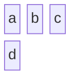
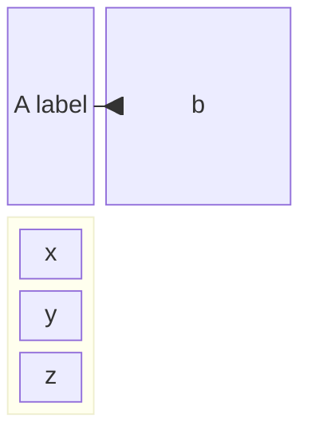
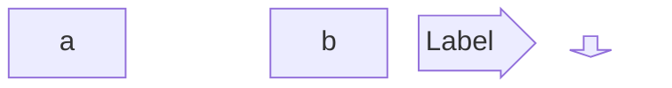
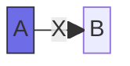

# Block Diagram Reference

High-level system/architecture/process overview with author-controlled grid
layout (blocks + connectors), not auto-layout.

## Minimal example

## Columns & composite blocks

- `columns N` — set column count; blocks wrap to the next row.
- `id:width` — span multiple columns (e.g. `b:2`).
- `block:id` … `end` — composite (nested) block.
- `space` / `space:N` — intentional gap (1 column default, or N columns).

## Block shapes

| Syntax | Shape |
| --- | --- |
| `id["text"]` | rectangle |
| `id("text")` | round-edged |
| `id(["text"])` | stadium |
| `id[["text"]]` | subroutine |
| `id[("text")]` | cylinder |
| `id(("text"))` | circle |
| `id((("text")))` | double circle |
| `id>text]` | asymmetric |
| `id{"text"}` | rhombus |
| `id{{"text"}}` | hexagon |
| `id[/"text"/]` | parallelogram |

Block arrows and space blocks:

Arrow directions: `right`, `left`, `up`, `down`, `x`, `y`.

## Edges & styling

## Notes
- You control placement explicitly via columns, widths, and `space`; this is
  the main reason to choose `block` over `flowchart`.
