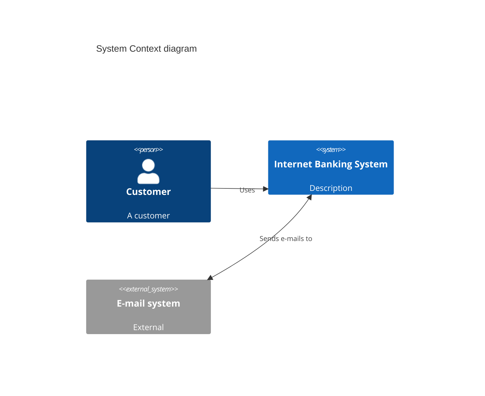

# C4 Diagram Reference

Software architecture at four zoom levels, plus a dynamic view. Experimental in
Mermaid; PlantUML-compatible syntax.

Diagram keywords: `C4Context`, `C4Container`, `C4Component`, `C4Dynamic`,
`C4Deployment`.

## System context (C4Context)



## Element functions (by level)

- Context: `Person`, `Person_Ext`, `System`, `SystemDb`, `SystemQueue`,
  `System_Ext`, `SystemDb_Ext`, `SystemQueue_Ext`.
- Container: `Container`, `ContainerDb`, `ContainerQueue`, `Container_Ext`,
  `ContainerDb_Ext`, `ContainerQueue_Ext`.
- Component: `Component`, `ComponentDb`, `ComponentQueue`, `Component_Ext`,
  `ComponentDb_Ext`, `ComponentQueue_Ext`.
- Deployment: `Deployment_Node` (alias `Node`), `Node_L`, `Node_R`.

Signatures (varies): `Person(alias, label, ?descr)`,
`Container(alias, label, ?techn, ?descr)`,
`Component(alias, label, ?techn, ?descr)`, `Deployment_Node(alias, label, ?type, ?descr)`.

## Boundaries (nesting)

```mermaid
C4Context
    Enterprise_Boundary(b0, "Bank") {
        Person(customer, "Customer")
        System(system, "Internet Banking")
    }
    Boundary(b1, "Internal", "boundary") {
        SystemDb(db, "Database")
    }
    System_Boundary(b2, "SystemBoundary") { }
    Container_Boundary(c1, "Containers") { }
```

## Relationships

- `Rel(from, to, label, ?techn)` — one-way.
- `BiRel(from, to, label)` — bidirectional.
- Directional variants: `Rel_U`, `Rel_D`, `Rel_L`, `Rel_R`, `Rel_Back`.
- Dynamic diagrams number flows automatically via `RelIndex(...)`.

## Styling & layout

```mermaid
C4Context
    UpdateElementStyle(customerA, $fontColor="red", $bgColor="grey")
    UpdateRelStyle(customerA, SystemAA, $textColor="blue", $lineColor="blue")
    UpdateLayoutConfig($c4ShapeInRow="3", $c4BoundaryInRow="1")
```

## Notes
- Layout is not fully automatic; shape position is controlled by statement
  order plus `UpdateLayoutConfig`.
- Named params use `$name=value`; unnamed params are positional.
