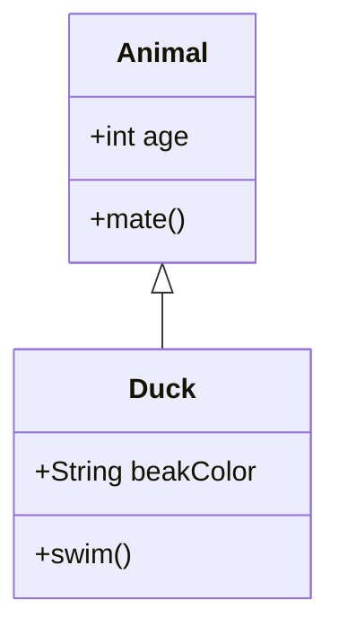
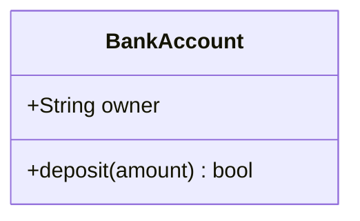
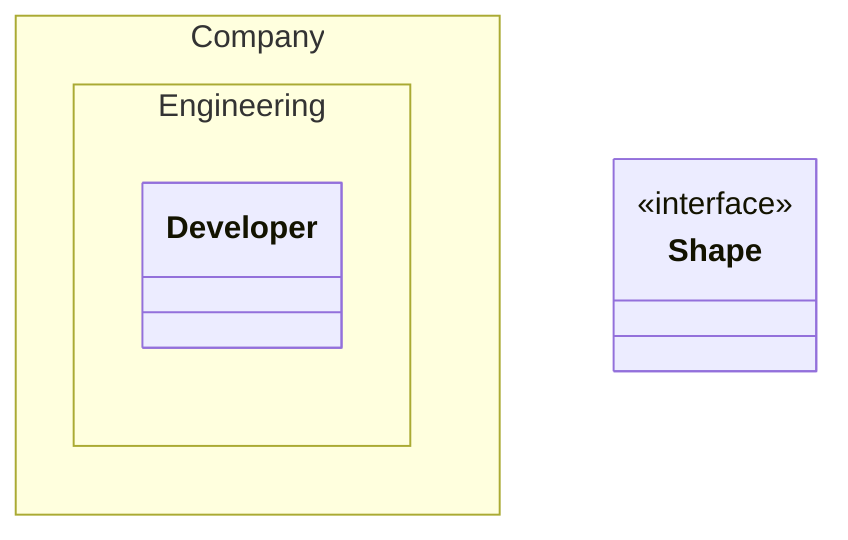

# Class Diagram Reference

UML static structure: classes, attributes, methods, and their relationships.

## Minimal example

## Defining classes

- `class Animal` — explicit.
- `Vehicle <|-- Car` — implicit via relationship.
- `class Animal["Label"]` — label.

## Members

Via `:` (one at a time) or `{}` (grouped). Methods are distinguished by `()`.

## Visibility & modifiers

- `+` public, `-` private, `#` protected, `~` package/internal.
- Method suffix `*` abstract, `$` static; field suffix `$` static.
- Return type: space after `()` then type, e.g. `getPoints() List~int~`.
- Generics use `~Type~`.

## Relationships

| Syntax | Meaning |
| --- | --- |
| `<|--` | inheritance |
| `*--` | composition |
| `o--` | aggregation |
| `-->` | association |
| `--` | link (solid) |
| `..>` | dependency |
| `..|>` | realization |
| `..` | link (dashed) |

Cardinality on association ends: `Customer "1" --> "*" Ticket`.

## Annotations & namespaces

## Notes
- Class names: alphanumeric + underscore/dash. Use backticks for special chars:
  `` class `Car Class!` ``.
