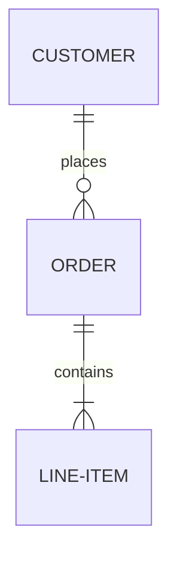
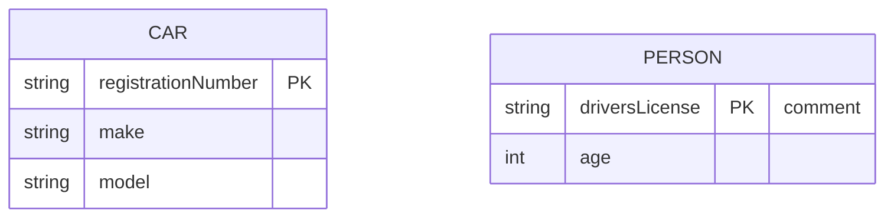

# Entity Relationship Diagram Reference

Data model / schema: entities, their attributes, and cardinality relationships
(crow's foot notation).

## Minimal example



## Relationship syntax

```
<first-entity> <cardinality><identifying><cardinality> <second-entity> : <label>
```

Cardinality markers (left/right of the middle):

| Left | Right | Meaning |
| --- | --- | --- |
| `|o` | `o|` | zero or one |
| `||` | `||` | exactly one |
| `}o` | `o{` | zero or more |
| `}|` | `|{` | one or more |

Middle `--` = identifying (solid); `..` = non-identifying (dashed).

## Attributes



- `type name` pairs; optional/nullable type ends with `?` (e.g. `string?`).
- Keys: `PK`, `FK`, `UK` (comma-separated for multiple).
- Comment in `"..."` at end of attribute.

## Aliases & direction

```mermaid
erDiagram
    direction LR
    p[Person] ||--o| a["Customer Account"] : has
```

## Notes
- Entity names are singular nouns; quoted for spaces/unicode.
- Label is read from the first entity's perspective.
