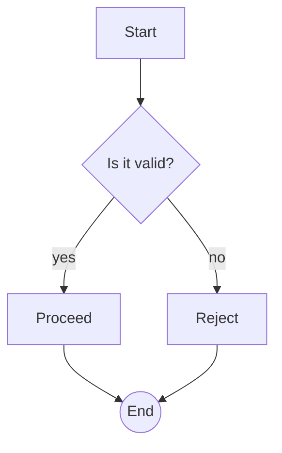
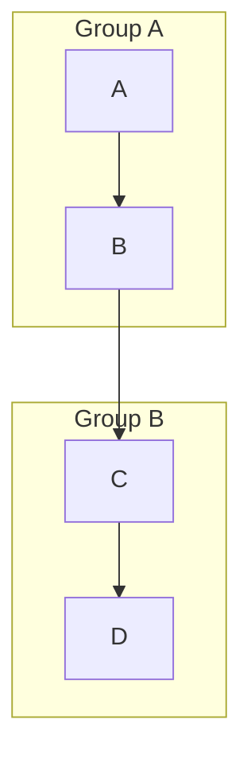
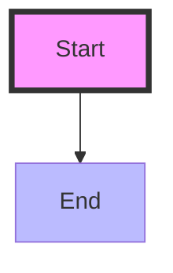

# Flowchart Reference

General-purpose node-and-edge diagram for processes, workflows, algorithms, and
decision logic.

## Minimal example

## Direction

`flowchart TD` (top-down, default), `TB` (same as TD), `BT`, `LR`, `RL`.

## Node shapes

| Syntax | Shape |
| --- | --- |
| `id[text]` | rectangle |
| `id(text)` | rounded |
| `id([text])` | stadium |
| `id[[text]]` | subroutine |
| `id[(text)]` | cylinder / database |
| `id((text))` | circle |
| `id(((text)))` | double circle |
| `id>text]` | asymmetric |
| `id{text}` | rhombus / decision |
| `id{{text}}` | hexagon |
| `id[/text/]` | parallelogram |
| `id[\text\]` | parallelogram alt |
| `id[/text\]` | trapezoid |
| `id[\text/]` | trapezoid alt |

## Edges

- `A --> B` — arrow
- `A --- B` — line (no arrow)
- `A -- text --> B` or `A -->|text| B` — labeled arrow
- `A -.-> B` — dotted arrow
- `A ==> B` — thick arrow
- `A --o B` — circle end
- `A --x B` — cross end

## Subgraphs

## Styling

## Notes
- Node ids are alphanumeric (plus underscores); use `id["text with spaces"]` for
  readable labels.
- A reserved word (e.g. `end`) as label must be quoted.
