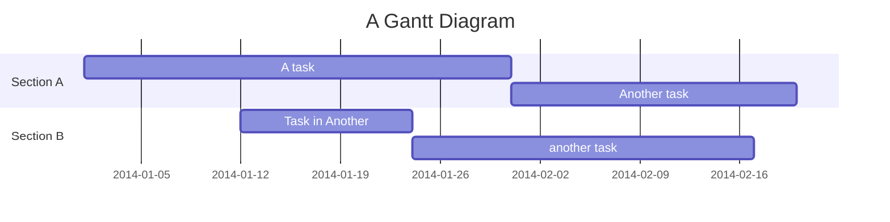
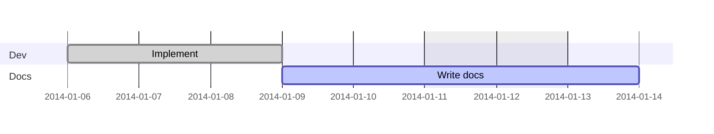

# Gantt Chart Reference

Schedule over time: tasks with durations, dates, dependencies, milestones.

## Minimal example

## Task syntax

`Task title :<tags>, <id>, <start>, <end|length>`

- Tags (optional, first): `done`, `active`, `crit`, `milestone`.
- Metadata items comma-separated; forms:
  - `<end>` — runs to that date/duration.
  - `<start>, <end|length>` — explicit start.
  - `after <taskId>, <end|length>` — start after task ends.
  - `<id>, <start>, <end|length>` — with reference id.
- `until <taskId>` — end at the referenced task's start.

Durations use `ms`, `s`, `m`, `h`, `d`, `w`, `M` (month), `y`.

## Sections & exclusions

## Milestones & markers

```mermaid
gantt
    dateFormat HH:mm
    axisFormat %H:%M
    Initial milestone : milestone, m1, 17:49, 2m
    Task A : 10m
    Final vert : vert, v1, 17:58, 1m
```

## Date / axis formats

- `dateFormat` — input dates (default `YYYY-MM-DD`).
- `axisFormat` — output labels (e.g. `%Y-%m-%d`, `%H:%M`).

## Notes
- Tasks are sequential by default; start defaults to the previous task's end.
