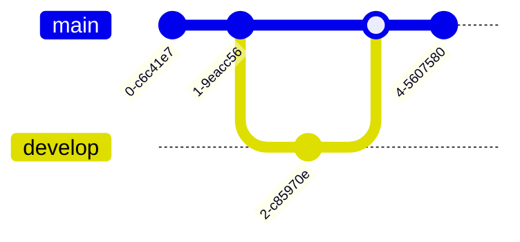

# GitGraph Reference

Git commit/branch/merge history across a repository's timeline.

## Minimal example

## Commands

- `commit` — new commit on current branch.
- `commit id: "name"` — custom id.
- `commit type: REVERSE|HIGHLIGHT|NORMAL` — reverse (crossed circle), highlight
  (rectangle), normal (solid circle).
- `commit tag: "v1.0.0"` — attach a tag.
- `branch name` — create + switch to new branch.
- `checkout name` — switch to existing branch (`switch` is an alias).
- `merge name` — merge branch into current branch (merge commit = double circle).
- `cherry-pick id: "commitId" parent: "parentId"` — copy a commit from another
  branch (parent required for merge commits).

## Orientation

`gitGraph LR:` (default), `gitGraph TB:`, `gitGraph BT:`.

## Notes
- Graph starts on a default `main` branch; commits go there unless branched.
- Branch names that look like keywords must be quoted: `branch "cherry-pick"`.
- Decorations (id/type/tag) can be combined, e.g.
  `merge develop id: "m1" tag: "v2" type: REVERSE`.
