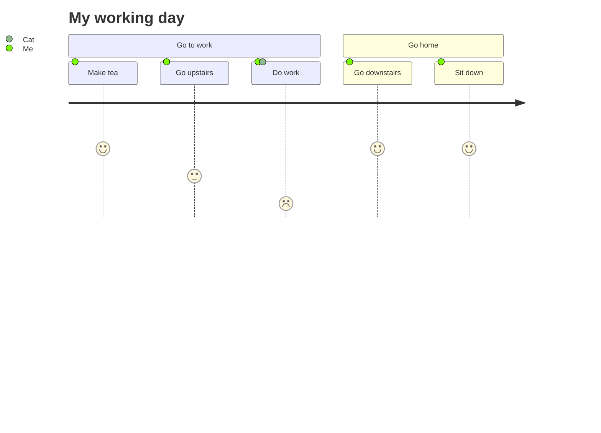

# User Journey Reference

High-level steps actors take to complete a task, scored for sentiment.

## Minimal example

## Syntax

- `title <text>` — optional title.
- `section <name>` — groups tasks.
- Task: `Task name: <score>: <comma-separated actors>`.
- Score is an integer 1–5 (5 = best).

## Notes
- Actors are arbitrary names; multiple actors comma-separated.
- One or more tasks per section.
