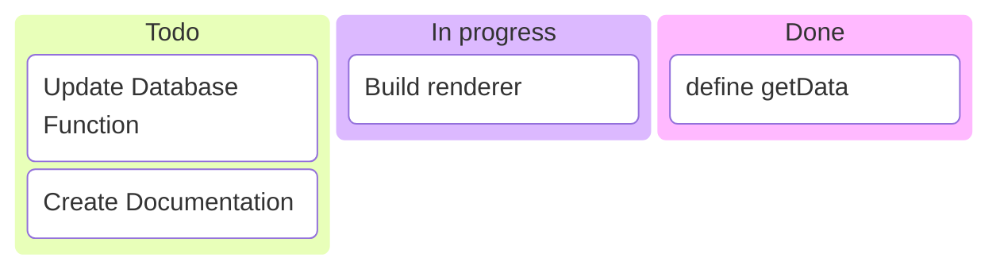
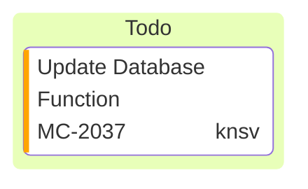

# Kanban Reference

Task board: columns as workflow stages holding tasks.

## Minimal example



## Syntax

- `kanban` keyword.
- Column: `columnId[Column Title]`.
- Task (indented under its column): `taskId[Task Description]`.
- Task metadata: `taskId[desc]@{ key: value, ... }`.

## Metadata



- `assigned` — who is responsible.
- `ticket` — ticket/issue number.
- `priority` — `Very High`, `High`, `Low`, `Very Low`.

## Config

```yaml
---
config:
  kanban:
    ticketBaseUrl: 'https://yourproject.atlassian.net/browse/#TICKET#'
---
```

`#TICKET#` is replaced with the ticket value to produce a link.

## Notes
- Proper indentation is required: tasks indented under their column.
- Column/task ids must be unique.
