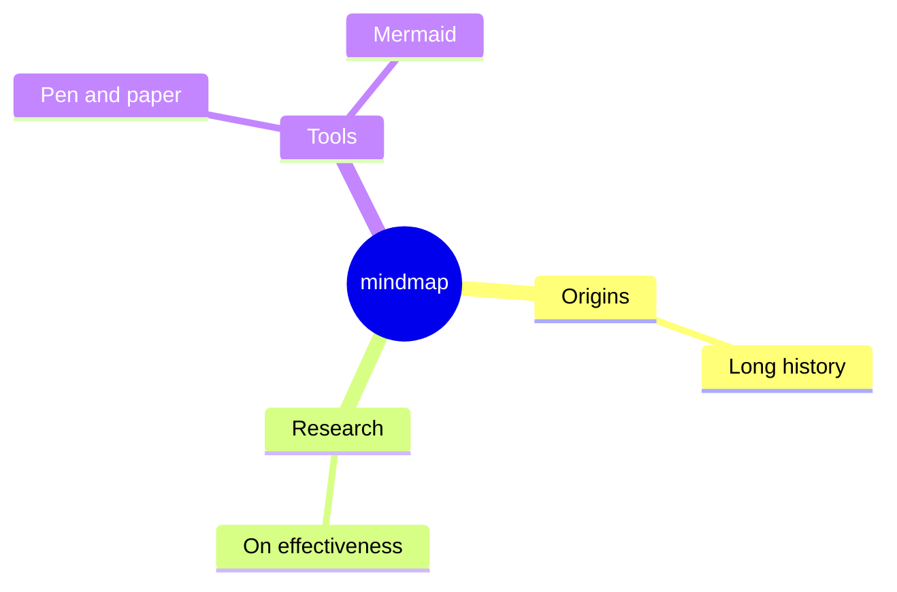
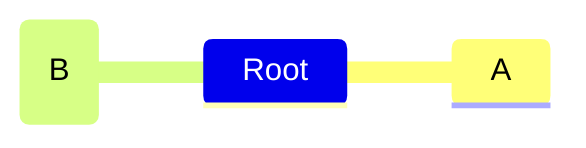
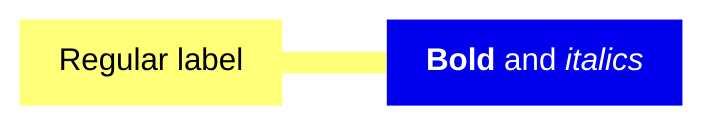

# Mindmap Reference

Hierarchical tree radiating from one central concept. Indentation defines depth.

## Minimal example

## Node shapes

| Syntax | Shape |
| --- | --- |
| `id[text]` | square |
| `id(text)` | rounded square |
| `id((text))` | circle |
| `id))text((` | bang |
| `id)text(` | cloud |
| `id{{text}}` | hexagon |
| plain text | default shape |

## Icons & classes

## Markdown strings

## Notes
- Relative indentation (not absolute) determines hierarchy.
- Optional `layout: tidy-tree` via frontmatter for a tidy tree layout.
