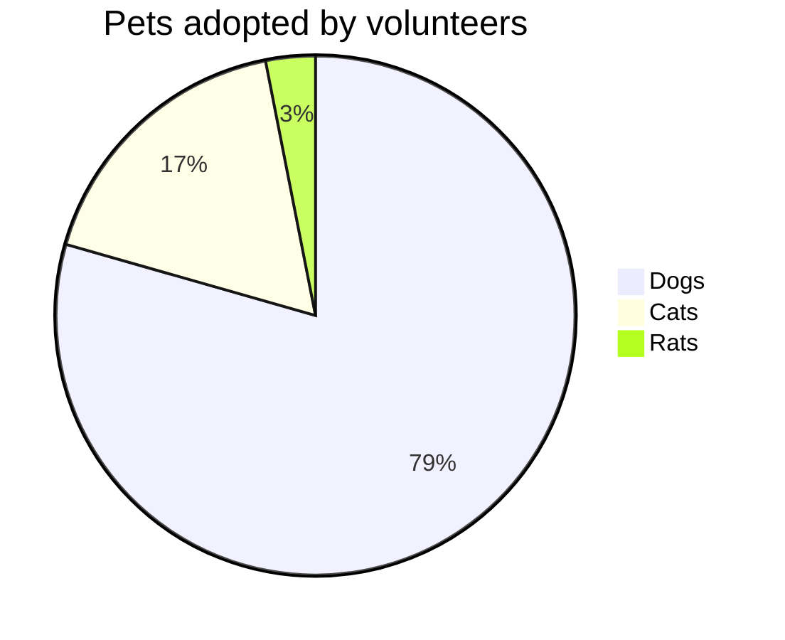
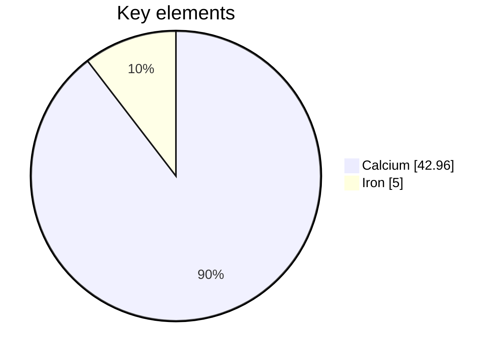

# Pie Chart Reference

Part-to-whole breakdown as proportional slices.

## Minimal example

## Syntax

- `pie` keyword; optional `showData` to render values after labels.
- Optional `title <text>`.
- Slices: `"label" : positiveValue` (values up to two decimals, > 0).

## Notes
- Values must be positive numbers; negative values error.
- Optional config: `donutHole` (0–0.9) renders a donut, `legendPosition`,
  `highlightSlice`.
