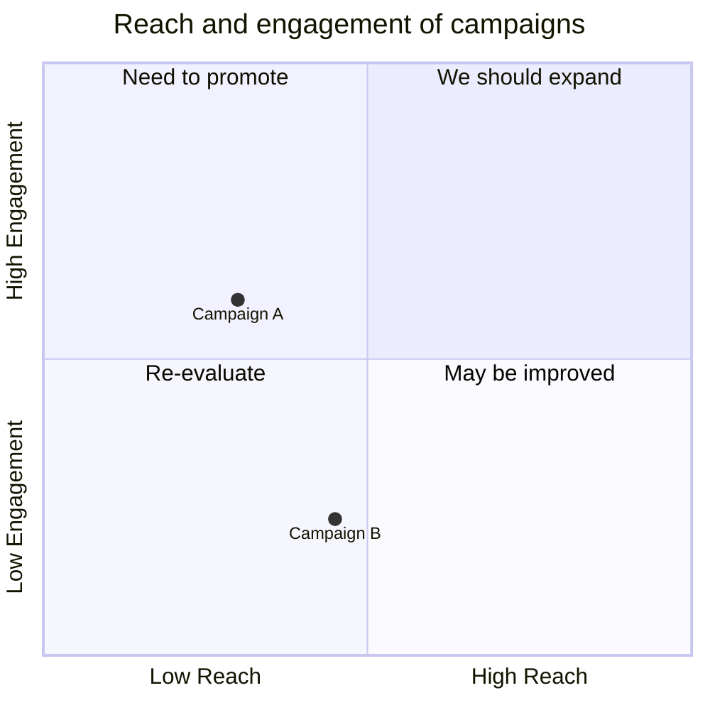
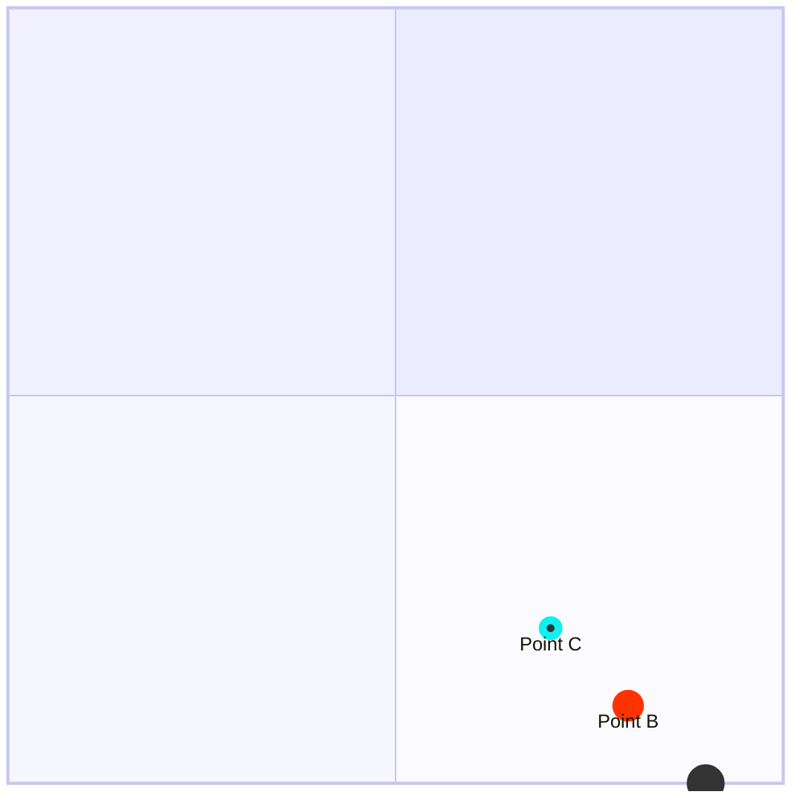

# Quadrant Chart Reference

2×2 grid: plot items on two axes into four labeled quadrants.

## Minimal example

## Syntax

- `x-axis <left> --> <right>` — left required, right optional.
- `y-axis <bottom> --> <top>` — bottom required, top optional.
- `quadrant-1` top-right, `quadrant-2` top-left, `quadrant-3` bottom-left,
  `quadrant-4` bottom-right.
- Points: `Label: [x, y]` with x and y in range 0–1.

## Point styling

## Notes
- Common use: prioritization (impact vs effort), risk matrices.
