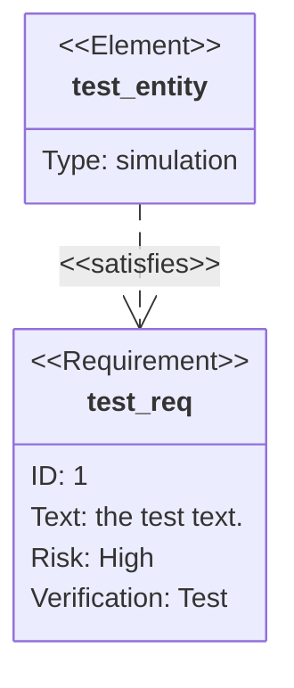

# Requirement Diagram Reference

SysML-style requirements, elements, and their traceability relationships.

## Minimal example



## Requirement

```
<type> name {
    id: <id>
    text: <text>
    risk: <risk>
    verifymethod: <method>
}
```

- Type: `requirement`, `functionalRequirement`, `interfaceRequirement`,
  `performanceRequirement`, `physicalRequirement`, `designConstraint`.
- Risk: `Low`, `Medium`, `High`.
- Verification method: `Analysis`, `Inspection`, `Test`, `Demonstration`.

## Element

```
element name {
    type: <type>
    docref: <ref>
}
```

## Relationships

`{source} - <type> -> {destination}` (or reverse with `<- <type> -`).

Types: `contains`, `copies`, `derives`, `satisfies`, `verifies`, `refines`,
`traces`.

## Direction

`direction LR` (also `TB`, `BT`, `RL`).

## Notes
- User text may be quoted; markdown formatting allowed inside quotes.
