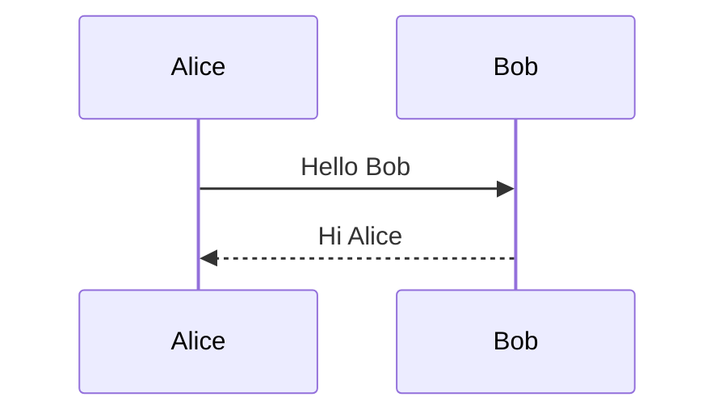
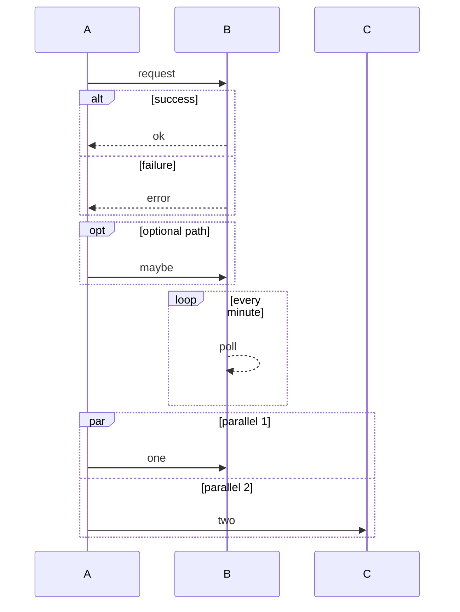
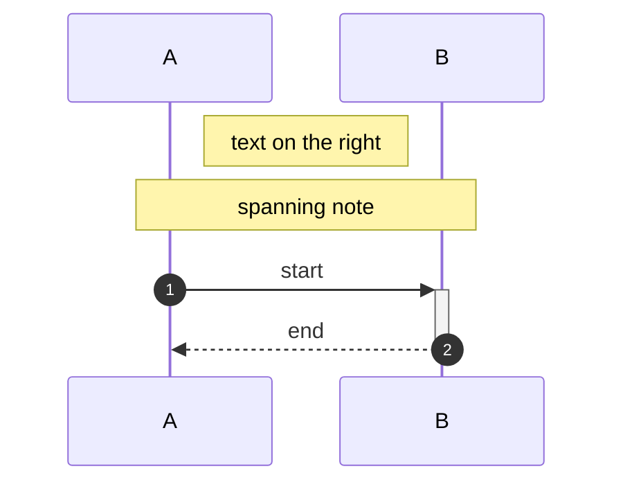

# Sequence Diagram Reference

Interaction diagram showing how processes/actors exchange messages and in what
order.

## Minimal example

## Participants

- `participant Name` — rectangle actor
- `actor Name` — stick-figure actor
- `participant A as Full Name` — alias
- Optional types: `participant A@{ "type": "database" }` (also `boundary`,
  `control`, `entity`, `collections`, `queue`).

## Messages / arrows

| Syntax | Meaning |
| --- | --- |
| `A->B: msg` | solid line, no arrowhead |
| `A-->B: msg` | dotted line, no arrowhead |
| `A->>B: msg` | solid line, arrowhead |
| `A-->>B: msg` | dotted line, arrowhead |
| `A-xB: msg` | solid line, cross |
| `A--xB: msg` | dotted line, cross |
| `A-)B: msg` | solid line, open arrow (async) |
| `A--)B: msg` | dotted line, open arrow (async) |

## Blocks

## Notes, activation, numbering

## Notes
- `activate A` / `deactivate A` or the `+` / `-` arrow suffix show lifelines.
- `box` … `end` groups participants vertically.
