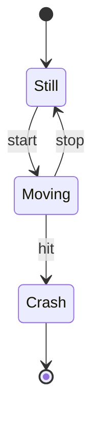
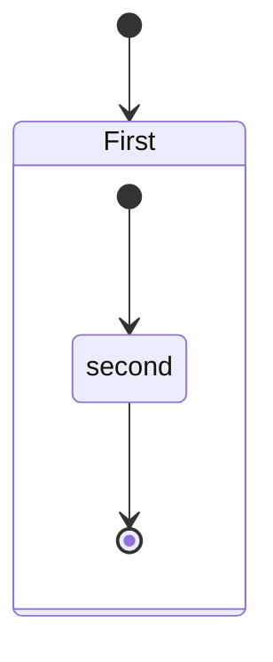
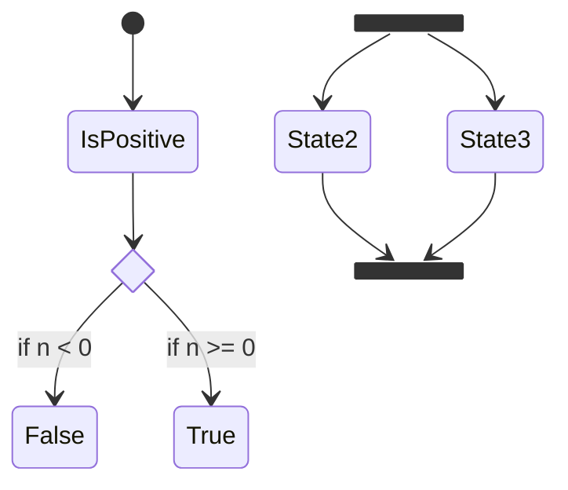
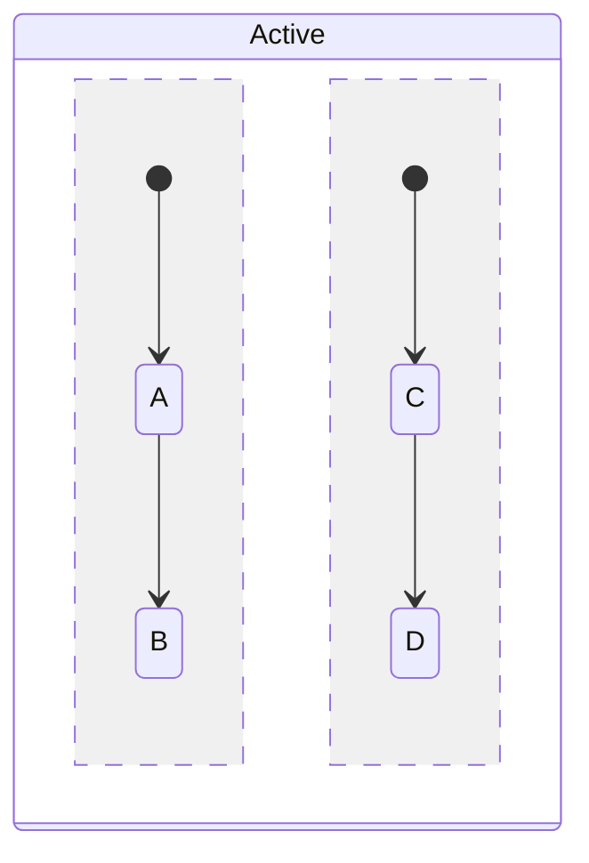
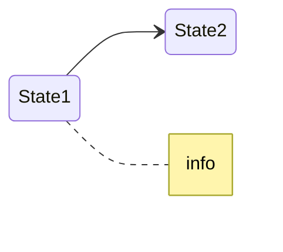

# State Diagram Reference

Finite state machine: states and transitions. Use `stateDiagram-v2`.

## Minimal example

## States

- `stateId` — bare id.
- `state "description" as s2` — id + description.
- `s2 : description` — description via colon.

## Transitions

- `s1 --> s2` — transition (auto-defines states).
- `s1 --> s2: label` — labeled transition.
- `[*] --> s1` start; `s1 --> [*]` end.

## Composite states

## Choice, fork/join, concurrency

Concurrency inside a composite state is separated with `--`:

## Notes & direction

## Notes
- `direction` accepts `LR`, `RL`, `TB`, `BT`.
