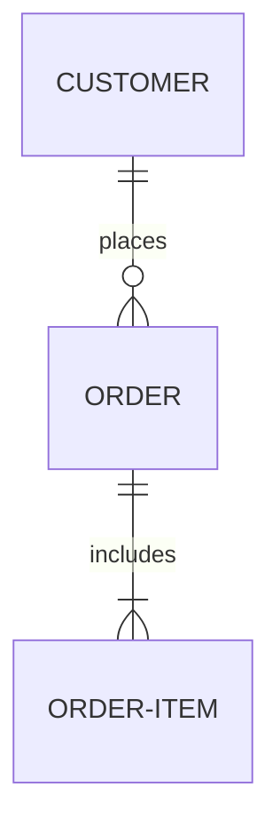
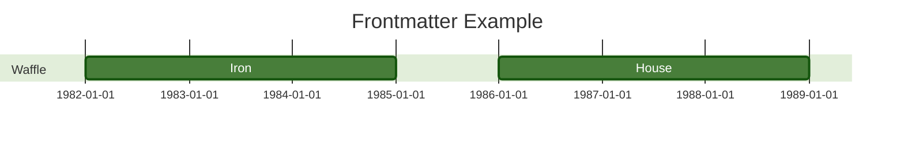
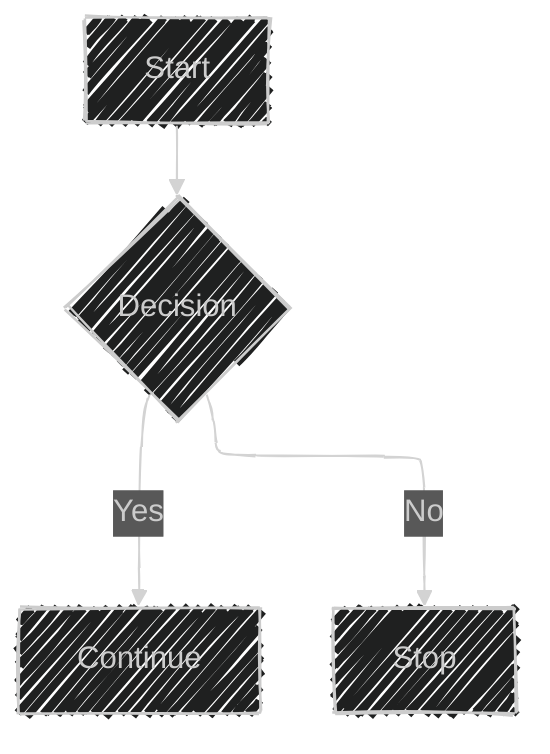

# Diagram Syntax Reference

General Mermaid syntax rules that apply across diagram types.

## Syntax structure
- Every diagram begins with the **diagram type declaration** (e.g. `flowchart`,
  `erDiagram`, `stateDiagram-v2`), followed by the diagram content. The
  declaration tells the parser which diagram to generate.
- The only exception is a **frontmatter** configuration block (see below).
- Line comments start with `%%`; the rest of the line is ignored.
- Unknown words or misspellings break a diagram; misspelled parameters silently
  fail (no error).

Example — ER diagram type declaration:



## Diagram breakers
Words/symbols that can break specific diagrams:

| Breaker | Reason | Solution |
| --- | --- | --- |
| `%%{ }%%` inside a comment | Confuses the renderer (looks like a directive) | Avoid `{}` in `%%` comments |
| `end` (flowcharts, sequence diagrams) | Parsed as a block terminator | Wrap in quotes: `"end"`, `(end)`, `{end}` |
| Nodes inside nodes (flowcharts) | Confuses the parser | Quote the outer text |

## Configuration
Configuration is applied three ways, functionally equivalent but suited to
different deployments:

1. `mermaid.initialize()` call — for API / `<script>` deployment.
2. **Frontmatter** — YAML at the start of the diagram code.
3. **Directives** — `%%{ }%%` inline, for font/color/theme changes.

### Frontmatter
YAML between `---` lines at the very top. The opening `---` must be the only
character on its line. YAML is indentation-sensitive and case-sensitive;
misspellings are silently ignored, but badly formed parameters break the
diagram.



### Directives
Limited reconfiguration just before render: `%%{ init: {...} }%%`, placed above
or below the diagram definition. Commonly used to change theme, font, or colors.

### Themes
`theme` is a config value selecting the color scheme (`default`, `dark`,
`forest`, `neutral`, `base`).

## Layout and look
Selecting `look` and `layout` via frontmatter config. Currently supported for
flowcharts and state diagrams (expanding to other types).

- **look**: `handDrawn` (sketch-like) or `classic` (traditional).
- **layout**: `dagre` (default) or `elk` (advanced, for large/complex diagrams;
  requires ELK integration).



### ELK options

```yaml
config:
  layout: elk
  elk:
    mergeEdges: true
    nodePlacementStrategy: LINEAR_SEGMENTS
```

- `mergeEdges`: `true`/`false` — combine parallel edges.
- `nodePlacementStrategy`: `SIMPLE`, `NETWORK_SIMPLEX`, `LINEAR_SEGMENTS`,
  `BRANDES_KOEPF` (default).
