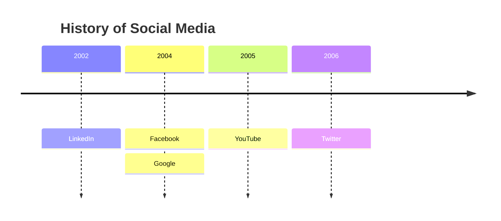
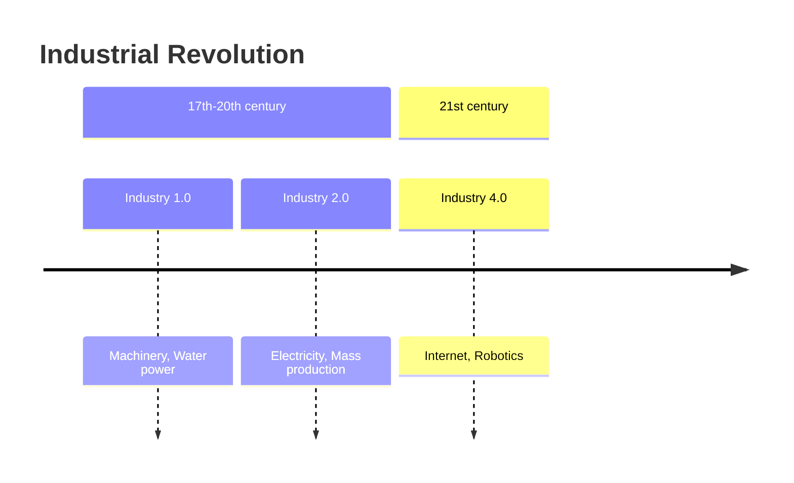

# Timeline Reference

Chronology of time periods mapped to events, optionally grouped into sections.

## Minimal example

## Syntax

- `timeline` keyword; optional `title <text>`.
- `{time period} : {event}` — one event per period.
- Multiple events: `{period} : {event1} : {event2}` or a bare `: {event}` on
  following lines.
- Both period and event are plain text (not limited to numbers).

## Sections / ages

## Direction

`timeline LR` (default) or `timeline TD` (top-down).

## Notes
- First period renders leftmost; first event of a period renders topmost.
- Use ` ` to force a line break.
