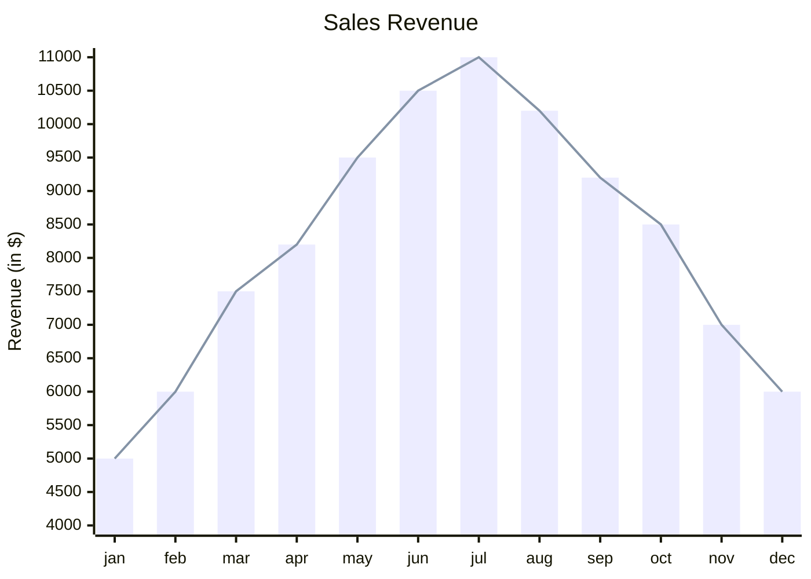
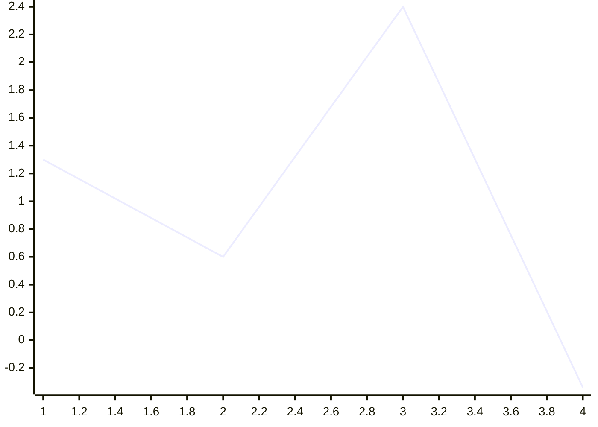

# XY Chart Reference

Bar and line charts for numeric data over x/y axes.

## Minimal example

## Syntax

- `xychart` keyword; `xychart horizontal` for horizontal orientation.
- `title "text"` — optional.
- x-axis categorical: `x-axis [cat1, "cat with space", cat3]`.
- x-axis numeric: `x-axis title min --> max`.
- y-axis numeric: `y-axis title min --> max` (or `y-axis title` to auto-range).
- `bar [values]` and `line [values]` — one or more series, all numeric.

## Simplest

## Notes
- Quotes only required for multi-word text.
- Config: `showDataLabel: true` shows bar values; `showDataLabelOutsideBar`
  moves them outside.
- Per-point labels on lines: `line [25 "Launch", 45, 72]`.
